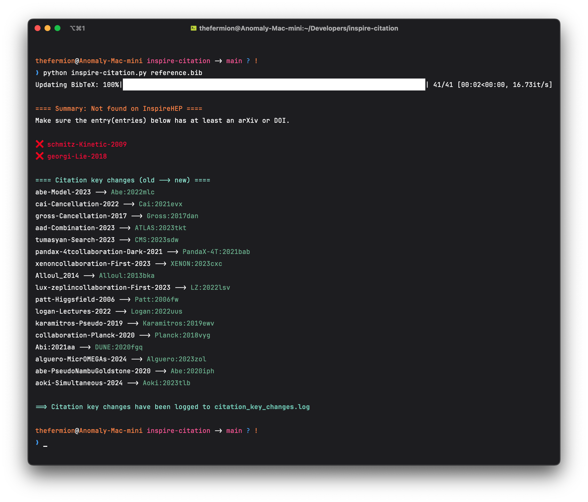

# inspire-citation

Are you tired of copying, pasting, and hopping between websites while preparing your bibliography? As high-energy physicists, we have plenty of other things to worry about. Let this Python script update your BibTeX file using official InspireHEP records. It automatically matches entries by arXiv ID, DOI, or title+year, and logs any citation key changes for easy LaTeX file updates.

## Features

- **Batch updates** all BibTeX entries from InspireHEP  
- Searches in order: **arXiv**, **DOI**, then **title+year**  
- Works with any BibTeX entry type  
- **Logs citation key changes** (`old_key → new_key`) to `citation_key_changes.log`  
- Backs up your original `.bib` as `filename-old.bib` and writes updates to the original filename  
- **Quiet by default**; enable per-entry logs with `--verbose`

## Requirements

```sh
pip install bibtexparser requests tqdm
```

## Usage

```sh
python inspireCitation.py [options] <bibfile>
```

- `<bibfile>`: your BibTeX file (e.g. `reference.bib`)  
- Options:  
  - `-v`, `--verbose` Enable per-entry 🔎/✅/❌ logs  

Example:

```sh
# quiet (default)
python inspireCitation.py reference.bib

# verbose output
python inspireCitation.py reference.bib --verbose
```

After running:

1. Your original `reference.bib` is renamed to `reference-old.bib`  
2. Updated entries are written to `reference.bib`  
3. If any keys changed, see `citation_key_changes.log`:

   ```log
   oldkey1 -> newkey1
   oldkey2 -> newkey2
   ```

The updated `reference.bib` now exactly matches the citations from InspireHEP. Enjoy!

## Preview



## Notes

- For best results, you just need to make sure that there is an `arxiv` or `doi` field in each bibliography entry  
- `Title+year` matching is a fallback when no arXiv ID or DOI is found.

Enjoy a smoother bibliography workflow 🍶🥃
